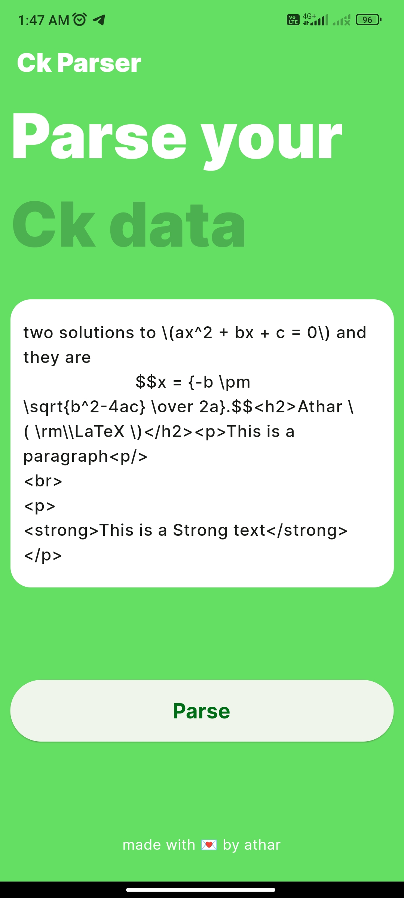
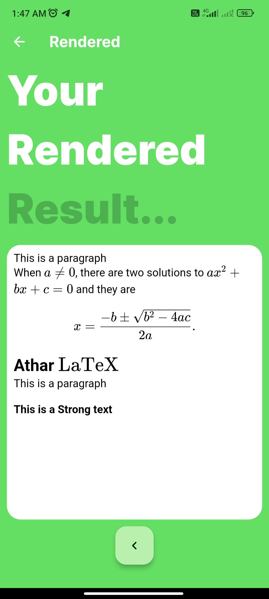

# texparser

`texparser` is an Android application that can parse HTML content along with LaTeX equations and render them as rich text. The project leverages the `flutter_tex` library to render LaTeX and HTML content.

## Getting Started

To run this Flutter project, follow these steps:

1. Clone this repository:
`https://github.com/WaniAthar/ckparser`

2. Move into the cloned directory:
`cd ckparser`

3. Open your terminal and run the following command:
`flutter run`

4. Choose your desired device to run the app.

## How to Use

To use the `texparser` app:

1. Open the app on your device.

2. You'll find a text box where you can enter your HTML, LaTeX, or code content.

3. After entering the content, click on the "Parse" button to render and display it as rich text.

## Screenshots

Here are some screenshots of the `texparser` app:

  

